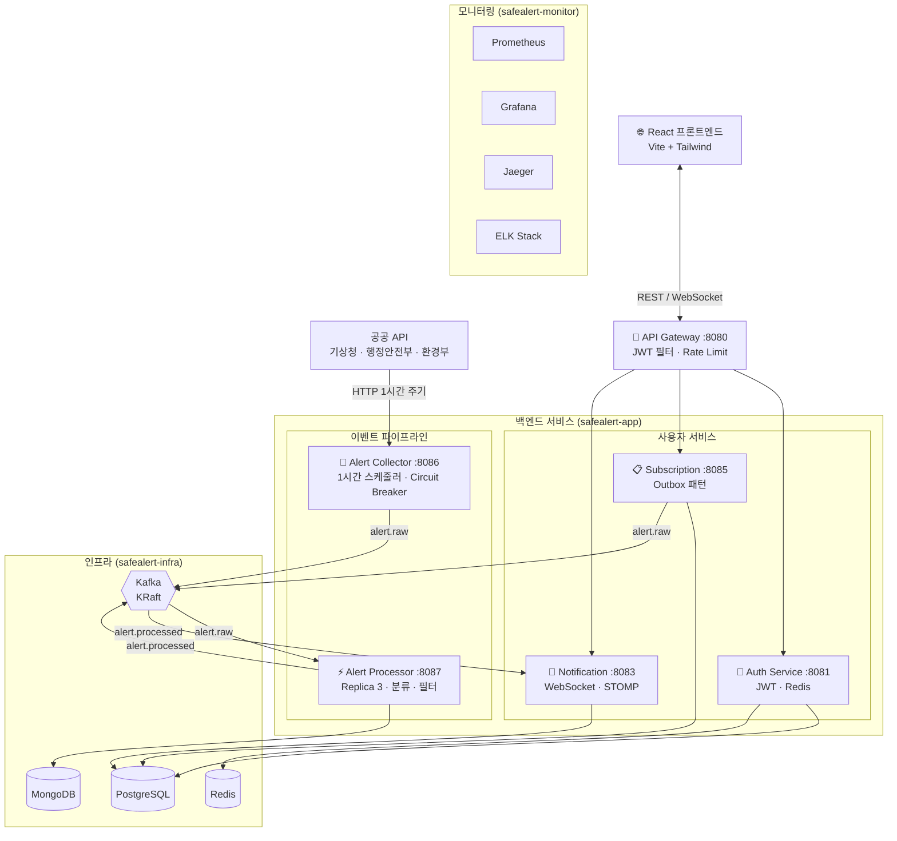

# SafeAlert 🚨

> 재난·기상 알림 구독 서비스 — MSA + Kafka + Kubernetes 기반 프로젝트


---

## 데모 영상

> 촬영 후 업로드 예정

---

## 소개

소방·안전 관리 현장에서 재난 정보 전달 지연의 위험성을 직접 경험한 개발자가 만든 고가용성 실시간 재난 알림 시스템입니다.

기상청·행정안전부·환경부 공공 API에서 재난 정보를 수집하고, 사용자가 구독한 **지역과 카테고리**에 맞춰 **5초 이내 실시간 알림**을 발송합니다.

단순한 CRUD를 넘어 MSA, 이벤트 기반 아키텍처, Kafka 파이프라인, WebSocket 실시간 알림, Kubernetes 배포까지 실제 프로덕션에 가까운 구조를 직접 구현하는 것을 목표로 합니다.

---

## 주요 기능

- **회원 인증**: JWT Access/Refresh Token, Redis 세션, Google/Kakao OAuth2 소셜 로그인
- **이메일 인증**: 회원가입 이메일 인증 코드, 비밀번호 찾기/재설정
- **구독 설정**: 시/군/구 단위 지역 구독 (최대 10개), 카테고리(기상·재난·미세먼지) 구독
- **실시간 알림**: WebSocket(STOMP)으로 구독 지역 재난 알림 5초 이내 수신
- **공공 API 수집**: 기상청·행정안전부·환경부 API 1시간 주기 자동 수집 + Circuit Breaker
- **알림 이력**: 수신한 알림 목록 조회, 지역·카테고리 필터링
- **관리자 기능**: 수동 알림 발송, 회원 관리, 통계 대시보드
- **API Gateway**: JWT 인증, Rate Limiting(분당 60건/IP), 라우팅
- **관측 가능성**: Prometheus·Grafana(메트릭), Jaeger(분산 트레이싱), ELK(로그 수집)
- **부하 테스트**: k6 — 100명 동시 로그인·구독 조회, WebSocket 50개 동시 연결 검증

---

## 기술 스택

| 분류 | 기술 |
|------|------|
| **Backend** | Java 17~24, Spring Boot 3.3~3.5, Spring Cloud Gateway |
| **Messaging** | Apache Kafka (KRaft 모드) |
| **Cache** | Redis 7 |
| **Database** | PostgreSQL 15, MongoDB 7 |
| **Frontend** | React 18, Vite, Tailwind CSS |
| **Infra** | Kubernetes (minikube), Docker |
| **Monitoring** | Prometheus, Grafana, Jaeger (OpenTelemetry), ELK Stack |
| **Pattern** | MSA, Transactional Outbox, Circuit Breaker, CQRS |
| **Test** | k6 (부하 테스트), JUnit 5 |
| **API 문서** | Swagger UI (springdoc-openapi) |

---

## 시스템 아키텍처



---

## 서비스 구성

| 서비스 | 포트 | 역할 | 기술 |
|--------|------|------|------|
| **API Gateway** | 8080 | JWT 인증, Rate Limiting, 라우팅 | Spring Cloud Gateway, WebFlux |
| **Auth Service** | 8081 | 회원가입, 로그인, JWT 발급, OAuth2 소셜 로그인, 이메일 인증 | Spring Boot, PostgreSQL, Redis |
| **Subscription Service** | 8085 | 시/군/구 단위 지역 구독, Outbox 이벤트 발행 | Spring Boot, PostgreSQL, Kafka |
| **Notification Service** | 8083 | Kafka 소비, WebSocket Push, 알림 이력 저장 | Spring Boot, WebSocket, Kafka, Redis |
| **Alert Collector** | 8086 | 공공 API 3종 1시간 주기 수집, Circuit Breaker | Spring Boot, Resilience4j, Kafka |
| **Alert Processor** | 8087 | 지역 분류, 중복 필터, MongoDB 저장 (Replica 3) | Spring Boot, Kafka, MongoDB |
| **React Frontend** | 5173 | UI, 실시간 알림 수신, 관리자 대시보드 | React 18, Vite, Tailwind CSS |

---

## 핵심 기술 선택 이유

### Kafka + Outbox 패턴
구독 변경 이벤트를 DB에 먼저 저장(Outbox)하고 스케줄러가 Kafka로 발행합니다.
Kafka가 일시적으로 다운돼도 이벤트가 유실되지 않습니다.

### API Gateway 중앙 인증
각 서비스가 JWT를 직접 검증하지 않고, Gateway가 검증 후 `X-User-Id` 헤더로 전달합니다.
인증 로직의 중복을 제거하고 서비스 코드를 단순하게 유지합니다.

### Redis Rate Limiting
`ratelimit:{ip}` 키에 TTL 1분을 설정해 분당 60건 초과 요청을 차단합니다.
DB 조회 없이 O(1) 시간으로 처리합니다.

### Alert Processor Replica 3
Kafka Consumer Group을 3개 파티션으로 분산해 처리량을 높이고 단일 장애점을 제거합니다.

---

## 부하 테스트 결과

> 도구: k6 | 환경: 로컬 PC | 상세: [docs/06_부하테스트_결과.md](docs/06_부하테스트_결과.md)

| 시나리오 | 동시 사용자 | 에러율 | p(95) 응답시간 | 결과 |
|---------|-----------|--------|--------------|------|
| 로그인 | 100명 | 0% | 1.86s | ✅ |
| 구독 조회 | 100명 | 0% | 375ms | ✅ |
| WebSocket 연결 | 50개 | 0개 | 9.91ms (연결) | ✅ |

**병목 개선**: HikariCP 커넥션 풀 10 → 30 조정으로 로그인 p(95) 2.66s → 1.86s **(30% 개선)**

---

## 로컬 실행 방법

### 사전 요구사항
- Docker Desktop
- Java 17+
- Node.js 18+

### 1. 인프라 실행

```bash
docker compose up -d postgresql redis kafka mongodb
```

### 2. 백엔드 서비스 실행 (서비스별 별도 터미널)

```bash
cd api-gateway && ./gradlew bootRun
cd auth-service && ./gradlew bootRun --args='--spring.profiles.active=local'
cd notification-service && ./gradlew bootRun
cd subscription-service && ./gradlew bootRun
cd alert-collector-service && ./gradlew bootRun
cd alert-processor-service && ./gradlew bootRun
```

### 3. 프론트엔드 실행

```bash
cd frontend && npm run dev
```

### 접속 주소

| 서비스 | 주소 |
|--------|------|
| 프론트엔드 | http://localhost:5173 |
| API Gateway | http://localhost:8080 |

### Swagger UI (API 문서)

| 서비스 | 주소 |
|--------|------|
| Auth Service | http://localhost:8081/swagger-ui/index.html |
| Subscription Service | http://localhost:8085/swagger-ui/index.html |
| Notification Service | http://localhost:8083/swagger-ui/index.html |

### 모니터링 (K8s 포트포워딩 필요)

```bash
kubectl port-forward svc/grafana 3000:80 -n safealert-monitor
kubectl port-forward svc/prometheus-server 9090:80 -n safealert-monitor
kubectl port-forward svc/jaeger-query 16686:16686 -n safealert-monitor
kubectl port-forward svc/kibana 5601:5601 -n safealert-monitor
```

| 도구 | 주소 |
|------|------|
| Grafana (admin/admin) | http://localhost:3000 |
| Prometheus | http://localhost:9090 |
| Jaeger | http://localhost:16686 |
| Kibana | http://localhost:5601 |

---

## 환경 변수

| 변수명 | 설명 | 예시 |
|--------|------|------|
| `JWT_SECRET` | JWT 서명 키 (32자 이상) | `my-secret-key-minimum-32-chars!!` |
| `DB_HOST` | PostgreSQL 호스트 | `postgresql.safealert-infra` |
| `DB_USER` | DB 사용자명 | `safealert` |
| `DB_PASS` | DB 비밀번호 | `safealert123` |
| `KAFKA_BOOTSTRAP` | Kafka 주소 | `kafka.safealert-infra:9092` |
| `SPRING_DATA_REDIS_HOST` | Redis 호스트 | `redis.safealert-infra` |

---

## 개발 현황

| Phase | 내용 | 상태 |
|-------|------|------|
| Phase 0 | Docker + K8s 인프라 구성 (Kafka, Redis, PostgreSQL, MongoDB) | ✅ 완료 |
| Phase 1 | Auth·Subscription·Notification·Alert 서비스, React 프론트엔드, OAuth2, 이메일 인증, 공공 API 파이프라인, 시/군/구 구독 시스템 | ✅ 완료 |
| Phase 2 | 이벤트 파이프라인 (Alert Collector → Kafka → Processor → Notification → WebSocket) | ✅ 완료 |
| Phase 3 | 안정성 (Transactional Outbox, Circuit Breaker, Kafka·Redis 장애 대응) | ✅ 완료 |
| Phase 4 | 관측 가능성 (Prometheus·Grafana·Jaeger·ELK 구축 + K8s safealert-monitor 이전) | ✅ 완료 |
| Phase 5 | 부하 테스트 (k6), Swagger API 문서화, README 정리 | 🔄 진행 중 |

---

## 문서

| 문서 | 설명 |
|------|------|
| [01_기획서](docs/01_기획서.md) | 프로젝트 배경, 목적, 핵심 기능 |
| [02_시스템아키텍처](docs/02_시스템아키텍처.md) | MSA 구조, 이벤트 흐름, K8s 구성 |
| [03_API_DB설계](docs/03_API_DB설계.md) | REST API 명세, DB 스키마 |
| [04_개발계획_WBS](docs/04_개발계획_WBS.md) | Phase별 작업 목록, 마일스톤 |
| [05_개발환경](docs/05_개발환경.md) | 로컬 개발 환경, DB 접속, K8s 모니터링 |
| [06_부하테스트_결과](docs/06_부하테스트_결과.md) | k6 부하 테스트 결과 및 개선 내역 |
| [07_기술선택_이유](docs/07_기술선택_이유.md) | MSA·Kafka·Redis·WebSocket 등 기술 선택 근거 |
| [08_시퀀스_다이어그램](docs/08_시퀀스_다이어그램.md) | 로그인·알림 발송·구독 등 주요 플로우 시퀀스 다이어그램 |
| [09_장애테스트_결과](docs/09_장애테스트_결과.md) | Kafka·Redis·Circuit Breaker 장애 주입 테스트 결과 |
| [10_트러블슈팅_기록](docs/10_트러블슈팅_기록.md) | 개발 중 발생한 문제·원인·해결 과정 기록 |

---

## 디렉토리 구조

```
SafeAlert/
├── api-gateway/                # Spring Cloud Gateway (JWT·Rate Limit)
├── auth-service/               # 인증 서비스 (JWT·OAuth2·이메일 인증)
├── subscription-service/       # 구독 서비스 (시/군/구 단위·Outbox)
├── notification-service/       # 알림 서비스 (WebSocket·Kafka·Redis)
├── alert-collector-service/    # 공공 API 수집 (기상청·행안부·환경부)
├── alert-processor-service/    # 알림 처리 (분류·중복 필터·MongoDB)
├── frontend/                   # React 18 + Vite + Tailwind CSS
├── load-test/                  # k6 부하 테스트 스크립트
│   ├── login.js
│   ├── subscription.js
│   └── websocket.js
├── k8s/
│   └── monitoring/             # ELK K8s YAML (Elasticsearch·Logstash·Kibana)
├── prometheus.yml              # Prometheus 스크레이프 설정 (6개 서비스)
├── logstash.conf               # Logstash 파이프라인 (TCP→Elasticsearch)
├── docker-compose.yml          # 로컬 개발 인프라 (DB·Kafka)
├── opentelemetry-javaagent.jar # OpenTelemetry 자동 계측 에이전트
└── docs/
    ├── 01_기획서.md
    ├── 02_시스템아키텍처.md
    ├── 03_API_DB설계.md
    ├── 04_개발계획_WBS.md
    ├── 05_개발환경.md
    └── 06_부하테스트_결과.md
```
