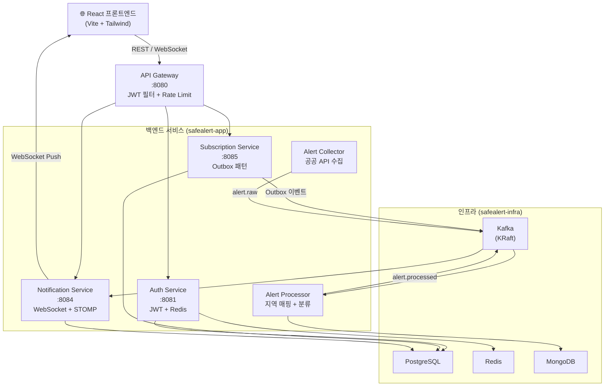

# SafeAlert 🚨

> 재난·기상 알림 구독 서비스 — MSA + Kafka + Kubernetes 기반 백엔드 프로젝트


---

## 소개

소방·안전 관리 현장에서 재난 정보 전달 지연의 위험성을 직접 경험한 개발자가 만든 고가용성 실시간 재난 알림 시스템입니다.

기상청·행정안전부·환경부 공공 API에서 재난 정보를 수집하고, 사용자가 구독한 **지역과 카테고리**에 맞춰 **5초 이내 실시간 알림**을 발송합니다.

단순한 CRUD를 넘어 MSA, 이벤트 기반 아키텍처, Kafka 파이프라인, WebSocket 실시간 알림, Kubernetes 배포까지 실제 프로덕션에 가까운 구조를 직접 구현하는 것을 목표로 합니다.

---

## 주요 기능

- **회원 인증**: JWT Access/Refresh Token 발급, Redis 기반 세션 관리
- **구독 설정**: 지역(시/도) 및 카테고리(기상·지진·미세먼지·재난) 구독 관리
- **실시간 알림**: WebSocket(STOMP)으로 구독 지역의 재난 알림 실시간 수신
- **알림 이력**: 수신한 알림 목록 조회 및 필터링
- **관리자 기능**: 수동 알림 발송, 통계 대시보드
- **API Gateway**: JWT 인증, Rate Limiting(분당 60건/IP), 라우팅

---

## 기술 스택

- **Backend:** Java 17, Spring Boot 3.3.5, Spring Cloud Gateway
- **Messaging:** Apache Kafka (KRaft)
- **Cache:** Redis
- **Database:** PostgreSQL, MongoDB
- **Frontend:** React 18, Vite, Tailwind CSS
- **Infra:** Kubernetes (minikube), Docker
- **Monitoring:** Prometheus, Grafana, Jaeger, ELK Stack
- **Pattern:** MSA, Transactional Outbox, Saga, CQRS, Circuit Breaker

---

## 시스템 아키텍처



---

## 서비스 구성

| 서비스 | 포트 | 역할 | 기술 |
|--------|------|------|------|
| **API Gateway** | 8080 | JWT 인증, Rate Limiting, 라우팅 | Spring Cloud Gateway, WebFlux |
| **Auth Service** | 8081 | 회원가입, 로그인, JWT 발급 | Spring Boot, PostgreSQL, Redis |
| **Subscription Service** | 8085 | 지역/카테고리 구독 관리, Outbox 이벤트 발행 | Spring Boot, PostgreSQL, Kafka |
| **Notification Service** | 8084 | 알림 수신, WebSocket Push, 이력 저장 | Spring Boot, WebSocket, Kafka |
| **Alert Collector** | — | 공공 API 주기적 수집, Kafka 발행 | Spring Boot, Scheduler |
| **Alert Processor** | — | 지역 매핑, 중복 필터, MongoDB 저장 | Spring Boot, Kafka, MongoDB |
| **React Frontend** | 3000 | UI, 실시간 알림 수신 | React 18, Vite, Tailwind CSS |

---

## 핵심 기술 선택 이유

### Kafka + Outbox 패턴
구독 변경 이벤트를 DB에 먼저 저장(Outbox)하고 스케줄러가 Kafka로 발행합니다.
Kafka가 일시적으로 다운돼도 이벤트가 유실되지 않습니다.

### API Gateway 중앙 인증
각 서비스가 JWT를 직접 검증하지 않고, Gateway가 검증 후 `X-User-Id` 헤더로 전달합니다.
인증 로직의 중복을 제거하고 서비스 코드를 단순하게 유지합니다.

### Redis Rate Limiting
`ratelimit:{ip}` 키에 TTL 1분을 설정해 분당 60건 초과 요청을 차단합니다.
DB 조회 없이 O(1) 시간으로 처리합니다.

---

## 로컬 실행 방법

### 사전 요구사항
- Docker Desktop
- minikube
- kubectl
- Java 17
- Node.js 18+

### 1. 인프라 실행 (K8s)

```bash
minikube start
kubectl apply -f infra/k8s/
kubectl get pods -n safealert-infra  # 모든 Pod Running 확인
```

### 2. DB 스키마 적용

```bash
# PostgreSQL auth_db
kubectl exec -n safealert-infra deployment/postgresql -- \
  psql -U safealert -d auth_db -f /sql/auth-schema.sql

# PostgreSQL subscription_db
kubectl exec -n safealert-infra deployment/postgresql -- \
  psql -U safealert -d subscription_db -f /sql/subscription-schema.sql
```

### 3. 백엔드 서비스 실행

```bash
# Auth Service
cd auth-service && ./gradlew bootRun

# API Gateway
cd api-gateway && ./gradlew bootRun

# Subscription Service
cd subscription-service && ./gradlew bootRun
```

### 4. 프론트엔드 실행

```bash
cd frontend
npm install
npm run dev
# http://localhost:3000 접속
```

---

## 환경 변수

| 변수명 | 설명 | 예시 |
|--------|------|------|
| `JWT_SECRET` | JWT 서명 키 (32자 이상) | `my-secret-key-minimum-32-chars!!` |
| `DB_HOST` | PostgreSQL 호스트 | `postgresql.safealert-infra` |
| `DB_USER` | DB 사용자명 | `safealert` |
| `DB_PASS` | DB 비밀번호 | `safealert123` |
| `KAFKA_BOOTSTRAP` | Kafka 주소 | `kafka.safealert-infra:9092` |
| `SPRING_DATA_REDIS_HOST` | Redis 호스트 | `redis.safealert-infra` |

---

## 개발 현황

| Phase | 내용 | 상태 |
|-------|------|------|
| Phase 0 | K8s 인프라 구성 (Kafka, Redis, PostgreSQL, MongoDB) | ✅ 완료 |
| Phase 1-A | Auth Service (JWT, Redis, PostgreSQL) | ✅ 완료 |
| Phase 1-B | API Gateway (JWT 필터, Rate Limiting) | ✅ 완료 |
| Phase 1-C | Subscription Service (구독 관리, Outbox, Kafka) | ✅ 완료 |
| Phase 1-D | React 프론트엔드 | 🚧 진행 중 |
| Phase 1-E | OAuth2 간편로그인 (Google, Kakao) | ⬜ 예정 |
| Phase 2 | 이벤트 파이프라인 (Alert Collector, Processor, Notification) | ⬜ 예정 |
| Phase 3 | 안정성 (Circuit Breaker, Saga 패턴, 장애 테스트) | ⬜ 예정 |
| Phase 4 | 관측 가능성 (Prometheus, Grafana, Jaeger, ELK) | ⬜ 예정 |
| Phase 5 | 부하 테스트 및 문서 마무리 | ⬜ 예정 |

---

## 문서

| 문서 | 설명 |
|------|------|
| [01_기획서](docs/01_기획서.md) | 프로젝트 배경, 목적, 핵심 기능 |
| [02_시스템아키텍처](docs/02_시스템아키텍처.md) | MSA 구조, 이벤트 흐름, K8s 구성 |
| [03_API_DB설계](docs/03_API_DB설계.md) | REST API 명세, DB 스키마 |
| [04_개발계획_WBS](docs/04_개발계획_WBS.md) | Phase별 작업 목록, 마일스톤 |

상세 API 스펙은 [API/DB 설계서](docs/03_API_DB설계.md)를 참고하세요.

| 서비스 | 주요 엔드포인트 |
|--------|--------------|
| Auth | `POST /api/auth/signup` `POST /api/auth/login` `POST /api/auth/refresh` |
| Subscription | `GET /api/subscriptions` `POST /api/subscriptions/regions` `PUT /api/subscriptions/categories` |
| Notification | `GET /api/notifications` `WS /api/notifications/ws` |
| Admin | `GET /api/admin/stats/alerts` `POST /api/admin/alerts/manual` |

---

## 디렉토리 구조

```
SafeAlert/
├── api-gateway/          # Spring Cloud Gateway
├── auth-service/         # 인증 서비스
├── subscription-service/ # 구독 서비스
├── frontend/             # React 프론트엔드
├── docs/
│   ├── 01_기획서.md
│   ├── 02_시스템아키텍처.md
│   ├── 03_API_DB설계.md
│   └── 04_개발계획_WBS.md
└── README.md
```
