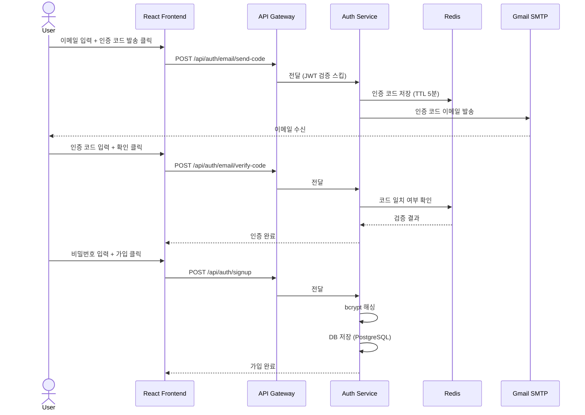
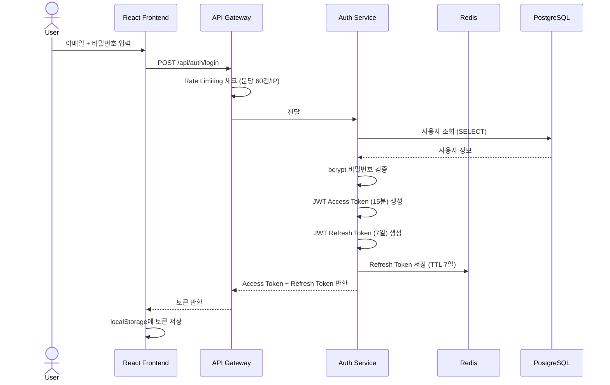
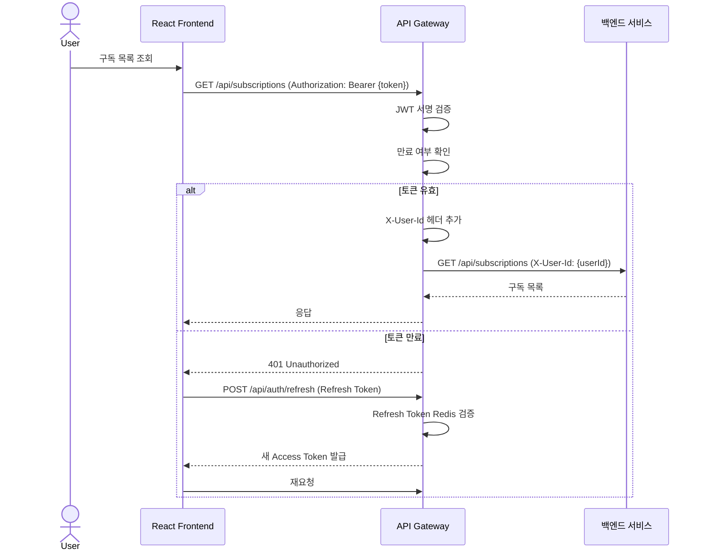
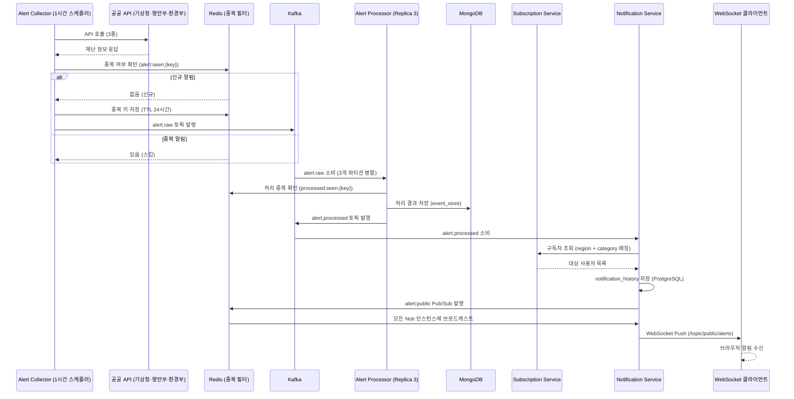
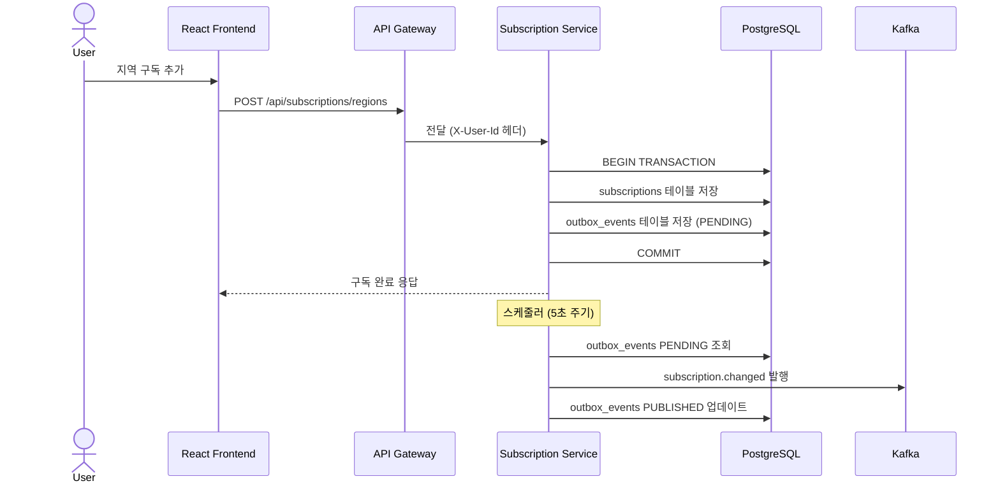

# SafeAlert 시퀀스 다이어그램

---

## 1. 회원가입 + 이메일 인증 플로우

```mermaid
sequenceDiagram
    actor User
    participant FE as React Frontend
    participant GW as API Gateway
    participant Auth as Auth Service
    participant Redis
    participant Gmail as Gmail SMTP

    User->>FE: 이메일 입력 + 인증 코드 발송 클릭
    FE->>GW: POST /api/auth/email/send-code
    GW->>Auth: 전달 (JWT 검증 스킵)
    Auth->>Redis: 인증 코드 저장 (TTL 5분)
    Auth->>Gmail: 인증 코드 이메일 발송
    Gmail-->>User: 이메일 수신

    User->>FE: 인증 코드 입력 + 확인 클릭
    FE->>GW: POST /api/auth/email/verify-code
    GW->>Auth: 전달
    Auth->>Redis: 코드 일치 여부 확인
    Redis-->>Auth: 검증 결과
    Auth-->>FE: 인증 완료

    User->>FE: 비밀번호 입력 + 가입 클릭
    FE->>GW: POST /api/auth/signup
    GW->>Auth: 전달
    Auth->>Auth: bcrypt 해싱
    Auth->>Auth: DB 저장 (PostgreSQL)
    Auth-->>FE: 가입 완료
```

---

## 2. 로그인 플로우

```mermaid
sequenceDiagram
    actor User
    participant FE as React Frontend
    participant GW as API Gateway
    participant Auth as Auth Service
    participant Redis
    participant DB as PostgreSQL

    User->>FE: 이메일 + 비밀번호 입력
    FE->>GW: POST /api/auth/login
    GW->>GW: Rate Limiting 체크 (분당 60건/IP)
    GW->>Auth: 전달
    Auth->>DB: 사용자 조회 (SELECT)
    DB-->>Auth: 사용자 정보
    Auth->>Auth: bcrypt 비밀번호 검증
    Auth->>Auth: JWT Access Token (15분) 생성
    Auth->>Auth: JWT Refresh Token (7일) 생성
    Auth->>Redis: Refresh Token 저장 (TTL 7일)
    Auth-->>GW: Access Token + Refresh Token 반환
    GW-->>FE: 토큰 반환
    FE->>FE: localStorage에 토큰 저장
```

---

## 3. 인증이 필요한 API 요청 플로우

```mermaid
sequenceDiagram
    actor User
    participant FE as React Frontend
    participant GW as API Gateway
    participant Service as 백엔드 서비스

    User->>FE: 구독 목록 조회
    FE->>GW: GET /api/subscriptions (Authorization: Bearer {token})
    GW->>GW: JWT 서명 검증
    GW->>GW: 만료 여부 확인
    alt 토큰 유효
        GW->>GW: X-User-Id 헤더 추가
        GW->>Service: GET /api/subscriptions (X-User-Id: {userId})
        Service-->>GW: 구독 목록
        GW-->>FE: 응답
    else 토큰 만료
        GW-->>FE: 401 Unauthorized
        FE->>GW: POST /api/auth/refresh (Refresh Token)
        GW->>GW: Refresh Token Redis 검증
        GW-->>FE: 새 Access Token 발급
        FE->>GW: 재요청
    end
```

---

## 4. 실시간 재난 알림 발송 플로우

```mermaid
sequenceDiagram
    participant Scheduler as Alert Collector (1시간 스케줄러)
    participant PublicAPI as 공공 API (기상청·행안부·환경부)
    participant Redis as Redis (중복 필터)
    participant Kafka
    participant Processor as Alert Processor (Replica 3)
    participant MongoDB
    participant Sub as Subscription Service
    participant Noti as Notification Service
    participant WS as WebSocket 클라이언트

    Scheduler->>PublicAPI: API 호출 (3종)
    PublicAPI-->>Scheduler: 재난 정보 응답
    Scheduler->>Redis: 중복 여부 확인 (alert:seen:{key})
    alt 신규 알림
        Redis-->>Scheduler: 없음 (신규)
        Scheduler->>Redis: 중복 키 저장 (TTL 24시간)
        Scheduler->>Kafka: alert.raw 토픽 발행
    else 중복 알림
        Redis-->>Scheduler: 있음 (스킵)
    end

    Kafka->>Processor: alert.raw 소비 (3개 파티션 병렬)
    Processor->>Redis: 처리 중복 확인 (processed:seen:{key})
    Processor->>MongoDB: 처리 결과 저장 (event_store)
    Processor->>Kafka: alert.processed 토픽 발행

    Kafka->>Noti: alert.processed 소비
    Noti->>Sub: 구독자 조회 (region + category 매칭)
    Sub-->>Noti: 대상 사용자 목록
    Noti->>Noti: notification_history 저장 (PostgreSQL)
    Noti->>Redis: alert:public Pub/Sub 발행
    Redis->>Noti: 모든 Noti 인스턴스에 브로드캐스트
    Noti->>WS: WebSocket Push (/topic/public/alerts)
    WS-->>WS: 브라우저 알림 수신
```

---

## 5. 구독 등록 + Outbox 이벤트 발행 플로우

```mermaid
sequenceDiagram
    actor User
    participant FE as React Frontend
    participant GW as API Gateway
    participant Sub as Subscription Service
    participant DB as PostgreSQL
    participant Kafka

    User->>FE: 지역 구독 추가
    FE->>GW: POST /api/subscriptions/regions
    GW->>Sub: 전달 (X-User-Id 헤더)
    
    Sub->>DB: BEGIN TRANSACTION
    Sub->>DB: subscriptions 테이블 저장
    Sub->>DB: outbox_events 테이블 저장 (PENDING)
    Sub->>DB: COMMIT
    Sub-->>FE: 구독 완료 응답

    Note over Sub: 스케줄러 (5초 주기)
    Sub->>DB: outbox_events PENDING 조회
    Sub->>Kafka: subscription.changed 발행
    Sub->>DB: outbox_events PUBLISHED 업데이트
```
